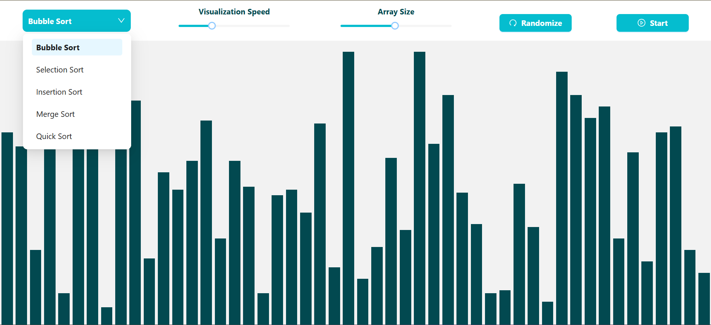
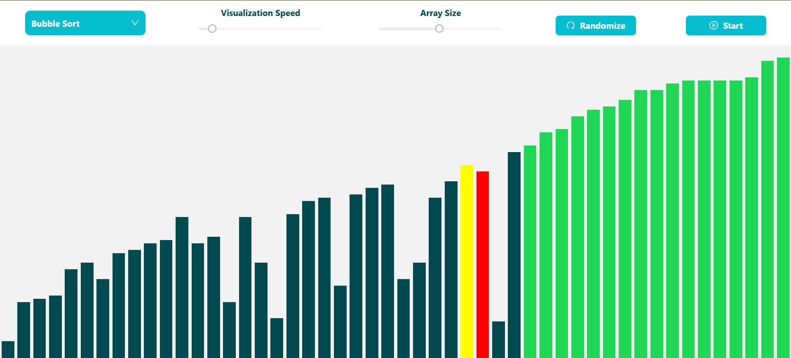

# Sorting Algorithm Visualizer 

An interactive React-based web app that visually demonstrates how popular sorting algorithms work step-by-step in real time. Watch the elements animate and understand how data gets sorted!

 **Live Demo**: [https://sarathi-c.github.io/Sorting-Algorithm-Visualizer](https://sarathi-c.github.io/Sorting-Algorithm-Visualizer)

<p align="center">
  
</p>

<p align="center">
  
</p>


##  Features

-  Visualizes Bubble Sort, Selection Sort, Insertion Sort, Merge Sort, and Quick Sort
-  Adjustable animation speed
-  Control array size and randomize elements
###  Color-coded States:

- 🟨 Yellow  → Currently selected
- 🟥 Red   → Comparing / Swapping
- 🟩 Green  → Final sorted position


##  Built With

- React.js
- HTML5 + CSS3
- Ant Design - UI framework
- JavaScript (ES6+)
- GitHub Pages for deployment


##  Getting Started

```bash
git clone https://github.com/sarathi-c/Sorting-Algorithm-Visualizer.git
cd Sorting-Algorithm-Visualizer
npm install
npm start
